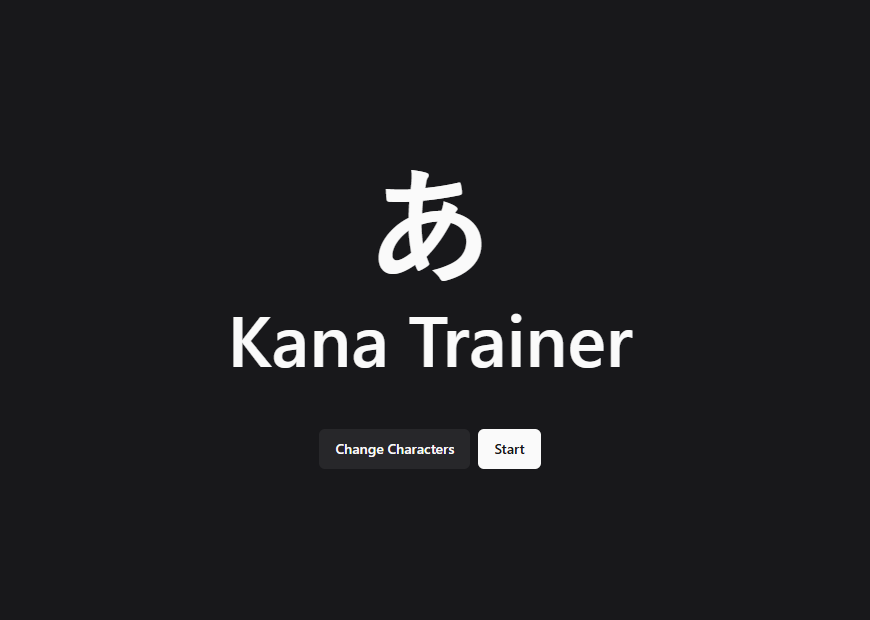
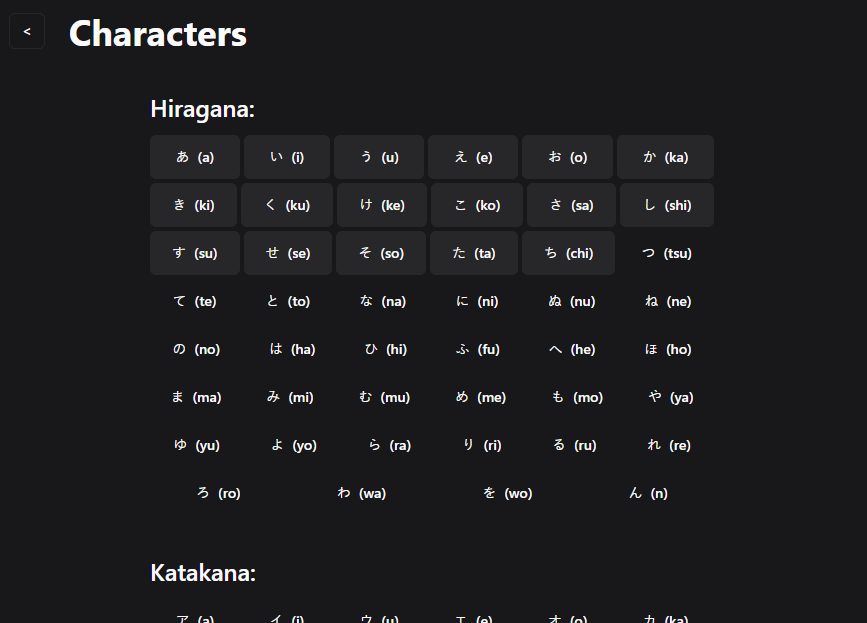

# Kana Trainer

Kana Trainer is a simple desktop application designed to help you learn Japanese kana (Hiragana and Katakana). Built with Electron, React, and TypeScript, it provides an interactive way to practice and memorize characters.

## Getting Started

### Prerequisites

- [Node.js](https://nodejs.org/) (Latest LTS recommended)
- [pnpm](https://pnpm.io/) (Recommended package manager)

### Installation

1. Clone the repository:

   ```bash
   git clone https://github.com/radeqq007/kana-trainer.git
   cd kana-trainer
   ```

2. Install dependencies:
   ```bash
   pnpm install
   ```

### Development

Start the development server implementation nicely hot-reloading for both Main and Renderer processes:

```bash
pnpm dev
```

## Building for Production

To create a distributable application:

```bash
# Build for Windows
pnpm build:win

# Build for macOS
pnpm build:mac

# Build for Linux
pnpm build:linux
```

Output files will be generated in the `dist` folder.

## Screenshots




